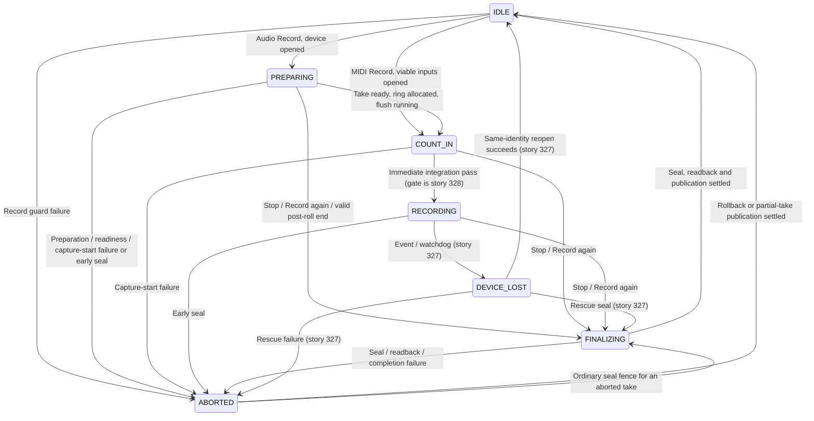

# Recording Reliability Design Book

> A reference design for **how the Java Digital Audio Workstation captures audio and MIDI so that
> a two-hour recording session ends with every performed note safely on disk, no matter what fails
> mid-take.** **No code in this document.** Every section is a complete proposal — the
> capture-to-disk pipeline, the real-time-safety contract for the capture path, the record state
> machine, multi-channel routing, device-loss rescue, and the capture workflow features — that the
> migration stages in §8 (user stories 323-328) implement.
>
> Companion to the four other new books of the functional-completion series:
> - `docs/design/AUDIO_ENGINE_WIRING_DESIGN_BOOK.md` — the audible core: every sound-making
>   promise of the UI is honoured by the engine (engine⇄project wiring, backend truth, metering).
> - `docs/design/PERSISTENCE_INTEGRITY_DESIGN_BOOK.md` — save it, reopen it, it's still there:
>   round-trip fidelity, atomic writes, journal-on-by-default recovery.
> - `docs/design/FAILURE_SURFACING_DESIGN_BOOK.md` — no silent failures, no button does nothing:
>   global exception visibility, the RT-safe error channel, the engine watchdog, production
>   notification injection.
> - `docs/design/INTERACTION_COMPLETENESS_DESIGN_BOOK.md` — every control does something real;
>   every visual tells the truth.
>
> And to the five existing books: `UI_DESIGN_BOOK.md` (visual language),
> `PLUGIN_VIEW_DESIGN_BOOK.md` (editor surface), `SETTINGS_VIEW_DESIGN_BOOK.md` (settings model),
> `PROJECT_MANAGER_DESIGN_BOOK.md` (project lifecycle), and
> `CONTROL_SYNCHRONIZATION_DESIGN_BOOK.md` (the wiring model this book's UI facts ride on).
>
> Those books define what the app looks like, how state synchronizes, and how failures become
> visible. This book defines **the one guarantee none of them can give: that recorded audio
> exists.** Today it does not — recorded takes live only in RAM, their WAV paths are fiction, and
> every take of every session is unconditionally lost on crash, on device failure, or at latest on
> project reload. The organizing guarantee of this book is the **session invariant** (§2.1):
> *everything the performer played is on disk, in the project, within seconds of being played.*

---

## 0. How to use this book

1. **Read §1 first.** A frank inventory of the recording path shipping today, cross-referenced
   with the actual code in `daw-core` and `daw-app`. Every later section is judged against the
   failures listed there.
2. **§2 is the foundation.** Ten non-negotiable principles, headed by the session invariant.
   When an implementation choice is unclear, the principle decides.
3. **§3 is the information model.** The capture-session entities, the record state machine, the
   on-disk layout, and the single take model. Names in §3 are the only names used in code,
   events, and docs.
4. **§4 is the pipeline architecture.** The capture ring, the flush service, the segment writer,
   atomic finalize, and crash recovery — the machinery that makes §2.1 true.
5. **§5 is the behavioural contract.** Tables a reviewer checks a PR against: what is allowed on
   the audio callback, every record-state transition, the segment lifecycle, routing validation,
   device-loss rescue, and workflow gating.
6. **§6 is the cross-cutting wiring.** The thread map, observer rules on the capture path, and
   the exact mechanisms this book consumes from `FAILURE_SURFACING_DESIGN_BOOK.md` and hands to
   `PERSISTENCE_INTEGRITY_DESIGN_BOOK.md`.
7. **§7 is the integration table** binding this book to the other nine.
8. **§8 is the migration path.** Six stages, one user story each (323-328), in dependency
   order, with the existing backlog stories each stage completes or unblocks.
9. **§9 is the rejection list.** Patterns the audit found and this design forbids returning.
10. **Appendix A** maps every construct here to the class/line it replaces or extends;
    **Appendix B** indexes the SKILL files, repository patterns, and research docs relied on.

The ASCII diagrams are deliberately wide (≈120 columns); render in a monospace-capable viewer.
File:line references are locators pinned to today's tree (verified 2026-08-03); content
correctness is what matters — drift is acceptable later.

---

## 1. Critique of recording shipping today

A frank inventory. The one-sentence summary of the audit's recording area: *the answer to "what
guarantees a 2-hour session ends with all audio safely on disk" is — nothing does; it is
guaranteed NOT to be on disk.*

### 1.1 No recorded sample ever reaches disk

`RecordingSession` (`daw-core/.../recording/RecordingSession.java`) is the capture buffer, and it
is RAM only. `recordAudioData` appends frames into a growing in-memory `[channel][sample]` array
(`RecordingSession.java:201-240`); the class contains zero file I/O — a grep for file-writing
calls across the recording package matches only the metronome settings JSON store
(`MetronomeSettingsStore.java:155`). The class javadoc promises the opposite: *"Each segment is
stored as a separate file … A crash only risks the current segment, not the entire session"*
(`RecordingSession.java:20-25`). Both sentences are false:

- `startNewSegment` constructs only a `RecordingSegment` metadata record naming
  `segment-NNN.wav`; no file is ever created (`RecordingSession.java:395-405`).
- `finalizeCurrentSegment` marks the in-memory record complete with a **wall-clock-estimated**
  sample count (`RecordingSession.java:407-423`) — even the metadata is approximate.
- `RecordingPipeline.stop()` stamps each recorded clip's source path from
  `getSegments().getFirst()` — the path of a file that never existed, and only the *first*
  segment even when rotation produced several (`RecordingPipeline.java:306-308`). Playback after
  stop works only because the full take is attached to the clip in RAM
  (`RecordingPipeline.java:317-319`).
- `ProjectSerializer.buildClipElement` persists only the `source-file` attribute — the in-memory
  audio is never serialized (`ProjectSerializer.java:376-378`); on reload the nonexistent path is
  flagged in `missingFiles` (`ProjectDeserializer.java:529-537`). A recorded take is
  unrecoverable after any restart.

And the fictional path is not even in the project: `TransportController.onRecord` targets
`Files.createTempDirectory("daw-recording-")` — the OS temp directory, wiped on cleanup or reboot
(`TransportController.java:433`) — while the status bar claims *"auto-save active"*
(`TransportController.java:484-485`). Meanwhile `ProjectManager` creates an `audio/` directory in
every project, documented as *"recorded audio files"*, that nothing ever writes into
(`ProjectManager.java:32,39,160`).

### 1.2 The capture path breaks the codebase's own real-time rules

The engine's render block is annotated `@RealTimeSafe` (`AudioEngine.java:909`), and the repo has
a bytecode sentinel that scans real-time paths for allocation
(`daw-core/src/test/.../annotation/RealTimeSafeContractTest.java`). The capture path violates
everything that contract stands for, on the device callback thread:

- `RenderPipeline` invokes `recordingCallback.onAudioCaptured` inline in the render block
  (`RenderPipeline.java:495-497`), reaching `RecordingSession.recordAudioData`, which **doubles**
  the capture array and copies the *entire take so far* whenever capacity runs out
  (`RecordingSession.java:210-217`). A 2-hour 48 kHz stereo take is ~2.8 GB resident with
  multi-hundred-MB copies on the deadline-bound callback.
- Segment-rotation bookkeeping allocates wall-clock objects per captured block
  (`RecordingSession.java:382-393`) and formats strings + iterates listeners at each rotation
  (`RecordingSession.java:395-405`) — all on the audio thread.
- Loop-take finalization runs *synchronously inside the callback* at every loop wrap:
  constructing a new session, taking a full-take trimmed copy, and building take/clip objects
  (`RecordingPipeline.java:895-964`, copy at `:921` via `RecordingSession.java:249-258`) —
  despite the pipeline's own comment that finalization I/O *"never runs on the audio callback
  thread"* (`RecordingPipeline.java:168-170`). The virtual-thread executor hand-off it gestures
  at is an explicit documented no-op (`RecordingPipeline.java:954-961`).

The house already knows how to do this correctly: the ASIO bridge captures into preallocated
lock-free `AudioBlockRing`s drained by a dedicated `asio-input-drain` thread, with every
allocation done at open time (`daw-sdk/.../audio/AsioBufferSwitchShim.java:99,161-162,223-224`).
The capture path predates that discipline and never adopted it.

### 1.3 The record state lies

The RECORDING state can be entered — and displayed — without any of its preconditions holding:

- **Double press orphans the take.** `onRecord` never checks transport state
  (`TransportController.java:399-413` validates armed tracks only); a second press while
  recording overwrites the `recordingPipeline` field with a new pipeline
  (`TransportController.java:443`) — the old pipeline's sessions never finalize — and reopens
  the live stream mid-take (`:457`). The code even documents a guard that does not exist:
  *"onRecord() is a no-op while already recording because of the state guard"*
  (`TransportController.java:891-895`), and the Record button is deliberately left enabled
  during recording (`:896-897`), so the destructive path is one click away. The MIDI side has
  the same bug: `startMidiRecording` re-puts a new recorder per track, replacing — and never
  stopping — the previous one, leaking the open MIDI device (`TransportController.java:775-778`).
- **Input-open failure records nothing, says Recording.** The catch around
  `startAudioInputOutput` shows an error toast but does not stop the already-started pipeline or
  transport (`TransportController.java:458-462`); lines `481-491` then set *"Recording — N tracks
  armed — auto-save active"* and light the REC indicator.
- **No backend is a successful record start.** `AudioEngine.startAudioInputOutput` with no
  backend logs *"recording without hardware I/O"* and returns success
  (`AudioEngine.java:500-503`) — the same fake-recording state.
- **Applying audio settings mid-record silently guts the take.** `applyConfiguration`
  unconditionally stops the stream and engine with no check for an active pipeline
  (`DefaultAudioEngineController.java:343-349`); the reopen is `startAudioOutput` — output-only,
  no input channels (`:418-419`) — while the pipeline keeps appending the pre-allocated routed
  buffers each block (`RecordingPipeline.java:790`), growing the take with stale content under a
  live REC indicator.

### 1.4 Capture state crosses threads with no synchronization

`RecordingSession`'s `active`/`paused`/`capturedAudio`/`capturedSampleCount` are plain fields
(`RecordingSession.java:47-48,68-70`) mutated by the audio thread (`recordAudioData`) while the
FX thread calls `stop()` and `getCapturedAudio()` — a data race that can tear the buffer-grow
copy or lose the take tail. The pipeline's `active` flag is likewise a plain boolean read in
`onAudioCaptured` (`RecordingPipeline.java:70`), and its `sessions`/`routedInputBuffers` maps are
plain `LinkedHashMap`s (`:53-55`). `Transport`'s `state` and `positionInBeats` are plain
non-volatile fields (`Transport.java:72-73`) written by the FX thread and read-modified-written
by the render thread (`advancePosition`, `Transport.java:250`). Only the engine's volatile
callback deregistration provides any ordering, and a callback already in flight still races the
stop sequence.

### 1.5 The pipeline records at a format the engine is not running

`applyConfiguration` builds the settings `AudioFormat` and sets it on the **engine only**
(`DefaultAudioEngineController.java:351-357`); `DawProject`'s format is a final field. But
`onRecord` constructs the `RecordingPipeline` with `project.getFormat()`
(`TransportController.java:443-445`) — pinned at the project's creation-time
96 kHz / 256-frame studio default (`MainController.java:778`, `AudioFormat.java:17`) regardless
of what the engine now streams at. Routed capture buffers are sized from the project format
(`RecordingPipeline.java:226,236`) while `recordToSessions` copies the frame count the engine
stream actually delivered (`:782`) — any settings buffer size above the project's overruns the
array **on the audio callback**, which the unguarded PortAudio upcall (§1.7 of
`FAILURE_SURFACING_DESIGN_BOOK.md`; `PortAudioBackend.java:432-448`) turns into JVM death. A
sample-rate mismatch corrupts every recorded clip's duration and position, computed from the
project rate (`RecordingPipeline.java:300-302`).

### 1.6 Multi-channel capture is capped, single-device, and silently wrong

The primary platform is Windows + ASIO + a multi-channel USB interface, and the capture path
cannot use it:

- `startAudioInputOutput` opens `format.channels()` input channels — the *project's* channel
  count, typically 2 — regardless of the interface or the armed tracks' routings
  (`AudioEngine.java:510-517`). Inputs 3+ can never be delivered.
- Only the **first** armed track's input-device index is used for the whole session
  (`TransportController.java:452-457`); other armed tracks' device choices are ignored.
- Worst: a track routed past the opened stream is not skipped — `recordToSessions` skips the
  arraycopy when the source channel is out of range but **still records the reused routed
  buffer** (`RecordingPipeline.java:781-790`), so a track on Input 3-4 of a 2-in stream captures
  whatever was last left in that scratch array, with no warning. Input metering silently skips
  the same out-of-range routings (`AudioEngine.java:977-983`), so the meters stay dark instead
  of diagnosing it.

### 1.7 Device loss is undetectable and the rescue apparatus is stage scenery

Story 214 landed a complete device-loss reaction: `onDeviceRemoved` stops the engine, flushes the
`IncompleteTakeStore`, enters `DEVICE_LOST`, and notifies
(`DefaultAudioEngineController.java:676-708`); `onDeviceArrived` reopens and resumes (`:711`).
None of it can run:

- The **only** publisher of `DeviceRemoved`/`DeviceArrived` in main source is the mock backend's
  test fixture (`MockAudioBackend.java:190-192`). The live PortAudio/JavaSound path emits no
  device events, nothing polls stream health, and the OS-level device-change hooks are no-op
  stubs.
- `captureRecordingFrames` — the only feeder of `IncompleteTakeStore` — has exactly one caller,
  a test (`DefaultAudioEngineController.java:652-654`; `DefaultAudioEngineControllerTest.java:196`).
  Its javadoc's claim that *"production wiring … calls this from the audio callback"* is false,
  so the rescue flush at `:699` always flushes an empty store.
- Production constructs the controller via the 2-arg constructor (`MainController.java:806`),
  which injects a **no-op notification sink** and roots the take store at the OS temp directory
  (`DefaultAudioEngineController.java:148-152`) — even if events fired, *"Audio device
  disconnected"* goes nowhere and the rescue WAV lands outside the project.
- `EngineState` promises a *"Reconnecting…"* transport indicator in its javadoc
  (`EngineState.java:8-9`); no production class subscribes to `engineStateEvents()`
  (`AudioEngineController.java:320`, `DefaultAudioEngineController.java:481` are the only
  references).

The irony: `IncompleteTakeStore` is the one class in the whole capture path that actually knows
how to write a WAV file (`IncompleteTakeStore.java:130-155`) — and it is never fed.

### 1.8 The capture workflow surfaces have no capture behind them

- **Count-in is a no-op for audio and destroys MIDI.** The count-in mode is user-visible in the
  metronome popup and Settings (`MetronomeController.java:42,140`, `SettingsDialog.java:1267`)
  and passed to the pipeline (`TransportController.java:426,445`) — but
  `generateCountInAudio`, the only audio use of the mode, has zero production callers
  (`RecordingPipeline.java:516`), and `start()` calls `transport.record()` immediately with no
  click and no delay (`:162-247`). Worse, the MIDI count-in window is anchored to the **first
  MIDI message received** (`MidiRecorder.java:342-346`), then notes inside the window are
  discarded (`:366-372`) — a performer who waits through the silent "count-in" and then plays
  loses their first bars.
- **Punch-in/out cannot be created.** `SET_PUNCH_IN`/`SET_PUNCH_OUT`/`TOGGLE_PUNCH` are declared
  with default shortcuts and listed in the Key Bindings UI (`DawAction.java:32-36`), but
  `buildActionHandlers` registers none of them (`KeyboardShortcutController.java:185` ff.). The
  ruler *draws* the punch region and its handles (`TimelineRuler.java:403,422`) but its mouse
  handlers implement loop-region drag only (`TimelineRuler.java:581-599`). The only production
  caller of `Transport.setPunchRegion` is the project deserializer
  (`ProjectDeserializer.java:385`) — a punch region can be *loaded* but never *made*, so the
  sample-accurate gating engine with its cosine crossfades (`RecordingPipeline.java:724-755`)
  and `Transport.isInputCaptureGated` (`Transport.java:460`, zero production consumers) are
  unreachable.
- **Loop-record and comping do not connect.** `setLoopRecord` has zero production callers
  (`RecordingPipeline.java:868`) — no toggle, no shortcut — so recording over a loop
  concatenates into one session instead of stacking takes. The COMP tool's press handler
  early-returns unless the track's comping is active (`ClipInteractionController.java:1083-1087`),
  and nothing ever activates it. `Track` carries **two** take models — `takeComping` (story 249)
  and `takeGroups` (story 132) side by side (`Track.java:98-99`) — the pipeline populates only
  `takeGroups` (`RecordingPipeline.java:294`), no UI renders them, and the serializer persists
  neither (grep: the only "take" in `ProjectSerializer` is a fold-state attribute, `:292`).
- **MIDI devices without timestamps collapse the take.** `MidiRecorder` uses -1 as its
  uninitialized start-time sentinel and sets it from the device timestamp
  (`MidiRecorder.java:220,342-343`); the `javax.sound.midi` contract permits a device to deliver
  -1 forever, which keeps the sentinel and lands every note at column 0.
- **The performer cannot hear themselves.** Input reaches the output only via the pass-through
  branch when playback is *not* active (`RenderPipeline.java:465-471`); the monitoring
  resolution API (`RecordingPipeline.java:644` and siblings) has zero production callers and
  `onRecord` hardcodes monitoring OFF (`TransportController.java:445`). Existing story 133 owns
  this; this book only keeps its seams alive (§8 Stage 4).

### 1.9 What today's code gets right (keep)

- **The segmentation model is right.** 30-minute / 500 MB segment rotation with per-segment
  metadata (`RecordingSession.java:33-37`) is exactly the shape long-session capture needs — it
  just needs actual files behind it.
- **The punch gating engine is right.** Frame-based regions, per-block re-evaluation for
  auto-punch re-entry, and 5 ms cosine crossfades at the boundaries
  (`RecordingPipeline.java:712-755`) are complete and tested; only the creation gestures are
  missing.
- **Latency compensation is resolved once per session** from driver-reported round-trip figures
  (`RecordingPipeline.java:215-222`, `RecordingSession.java:53-66`) — the right discipline.
- **`IncompleteTakeStore` is a working WAV writer** with a sane on-disk contract
  (`IncompleteTakeStore.java:28-35`) — it needs feeding and re-rooting, not rewriting.
- **The take data model exists twice** — which is a flaw (§1.8) — but each half is individually
  sound: `TakeGroup`'s append-per-lap shape fits capture; `TakeComping`'s lane/swipe model fits
  editing. §3.5 unifies them rather than inventing a third.
- **The ASIO bridge is the house RT pattern.** Preallocated `AudioBlockRing`s, a dedicated drain
  thread, catch-everything upcall guards, and the `RealTimeSafeContractTest` bytecode sentinel
  (stories 311-312) are the proven local idiom this book generalises to capture.
- **The device-loss *reaction* chain is built** (§1.7) — detection and feeding are what's
  missing, and `FAILURE_SURFACING_DESIGN_BOOK.md` supplies them.

### 1.10 Summary of the gap

| Symptom (today)                                    | Root cause                                      | This book's fix        |
|----------------------------------------------------|-------------------------------------------------|------------------------|
| Every take lost on crash/reload; paths are fiction | No disk writer behind the segment model (§1.1)  | Flush service + atomic segments (§4.2-4.4, Stage 1) |
| Takes in OS temp, absolute paths serialized        | Temp-dir output root (§1.1)                     | Project `audio/` home, relative paths (§2.6, §3.3) |
| Dropout risk grows with take length                | Allocation/copy on the callback (§1.2)          | Preallocated ring, flush thread owns growth (§4.2, Stage 2) |
| REC indicator on, nothing captured                 | State transitions before preconditions (§1.3)   | Record state machine with guards (§3.2, §5.2, Stage 3) |
| Torn buffers at stop; lost seeks                   | Unsynchronized cross-thread state (§1.4)        | Stop fence + single-writer rules (§5.1, §5.2) |
| Callback crash when settings ≠ project format      | Pipeline pinned to project format (§1.5)        | Engine-format capture, declared divergence (§2.7, §5.1) |
| Inputs 3+ record garbage silently                  | Project-channel open + skip-but-record (§1.6)   | Routing contract: validate or zero, never lie (§5.4, Stage 4) |
| Unplug mid-take = undetected total loss            | No detection, unfed rescue, no-op notify (§1.7) | Device-loss contract on the flush pipeline (§5.5, Stage 5) |
| Count-in/punch/loop-takes/comping all dead         | Capture side of landed models unwired (§1.8)    | Workflow gating contract (§5.6, Stage 6) |

---

## 2. Design principles

Ten non-negotiable rules. Each carries its rationale; when stages conflict, the lower-numbered
principle wins.

### 2.1 The session invariant

**Everything the performer played is on disk, inside the project, within a bounded number of
seconds of being played.** Not at stop. Not at save. During capture. The maximum audio at risk
at any instant is the ring contents plus the un-forced tail of the current segment — a fixed,
documented bound (§4.3), not a function of take length. This is the guarantee every other
principle serves: a JVM crash, a device unplug, a power cut mid-take must each cost at most that
bound. Rationale: recording is the one activity in a DAW that cannot be redone — a lost mix
setting is annoyance, a lost take is a lost performance. The audit found the current design
inverts this completely (§1.1).

### 2.2 The callback copies into preallocated memory — nothing else

On the audio callback, the capture path may do exactly: bounded arithmetic, reads of volatile
scalars, and copies into memory allocated before the stream started. No allocation, no locks, no
string formatting, no wall-clock objects, no listener iteration, no `Flow` publishing (a
`SubmissionPublisher.offer` takes a lock — the story-311 lesson), no file I/O. This is the same
contract `@RealTimeSafe` (`daw-sdk/.../annotation/RealTimeSafe.java`) already imposes on the
render path and the ASIO shim already obeys; capture joins it and is scanned by the same
bytecode-sentinel test. Rationale: a dropout during a take is recorded forever; the capture path
must be the *most* deadline-disciplined code in the app, and today it is the least (§1.2).

### 2.3 One writer per byte

Each stage of the pipeline has exactly one writing thread: the device callback writes the ring;
the flush thread reads the ring and writes segment files and the UI mirror; the FX thread writes
only coordination state (the record state machine) and reads published facts. No buffer is
written by two threads; no thread writes at two stages. Rationale: §1.4's races are not fixed by
adding locks to a shared-everything design — they are fixed by a topology in which the contested
writes do not exist. This mirrors the single-writer rule of
`CONTROL_SYNCHRONIZATION_DESIGN_BOOK.md §2.4`, applied one layer down.

### 2.4 The record state machine never lies

The UI may show RECORDING only when: armed tracks exist, the input stream opened at the required
width, the capture ring is allocated, and the flush service is running. Any precondition failing
aborts the transition and *visibly* rolls back everything already started. State is owned by one
coordinator; every surface (REC indicator, status bar, transport buttons, status strip) renders
the same machine. Rationale: a false RECORDING state is worse than a refused one — the performer
sings to a dead pipeline (§1.3). "Honest state" is also this book's half of the pact with
`FAILURE_SURFACING_DESIGN_BOOK.md`: it makes failures visible; we make states truthful.

### 2.5 Crash-consistent by construction

At every instant of a session, the on-disk state is recoverable by a reader that knows only the
layout rules of §3.3-3.4: streaming segments carry enough self-description (fixed data offset,
length-derivable sample count) that a crash-orphaned file yields playable audio; finalize is an
atomic rename so a segment is either visibly in-progress or fully sealed — never half-sealed.
Rationale: crash recovery that depends on in-RAM knowledge is not recovery (§1.1); the journal
work of story 298 and `PERSISTENCE_INTEGRITY_DESIGN_BOOK.md` can only replay what disk knows.

### 2.6 Session audio lives in the project directory, project-relative

The only home for captured audio is `<project>/audio/` — the directory `ProjectManager` already
creates and documents for exactly this purpose (`ProjectManager.java:32,39,160`). Serialized
references are project-relative, so the project folder is self-contained: moving, archiving, or
backing up the folder preserves every take. The OS temp directory never holds session audio.
Rationale: §1.1's temp-dir choice makes takes hostage to OS cleanup; and `Project Hub` (story
296) guarantees every project has a real directory from creation, so there is no
"unsaved-project" excuse for temp storage.

### 2.7 Capture follows the engine's stream format

The pipeline derives sample rate, channel count, and buffer size from the format the engine is
*actually streaming*, captured at record-start — never from the project's creation-time format.
Per-block sizes come from the frame count the stream delivers, never from a captured constant.
Where the engine format diverges from the project format, the divergence is **declared**: the
clip records the take's true sample rate, beat math uses the true rate, and the mismatch is
surfaced through the sample-rate-badge seam (owned by `INTERACTION_COMPLETENESS_DESIGN_BOOK.md`,
story 342) rather than silently resampled or — as today — silently overrun (§1.5). Rationale:
the settings dialog can legitimately run the engine at any supported format; recording must be
correct at all of them, not only the default.

### 2.8 Device loss is an event with a contract, not a mystery

The capture pipeline treats device loss as a *planned input*, not an exception: a
`DeviceRemoved` (from the watcher `FAILURE_SURFACING_DESIGN_BOOK.md` story 338 provides, or the
ASIO events story 316 makes live) triggers the sealed sequence of §5.5 — halt capture, seal
segments, register the rescued take, notify, enter DEVICE_LOST — and reconnection resumes
cleanly. Rationale: USB interfaces get unplugged; a design that only works when hardware never
fails does not meet §2.1. The reaction chain already exists (§1.7); this book gives it its feed
and its subject matter.

### 2.9 Salvage is the pipeline's normal shape, not a special mode

There is no separate "rescue buffer" running in parallel with capture. Because §2.1 puts audio
on disk continuously, rescue *is* the ordinary seal step applied early: the same segments, the
same manifest, the same reader. `IncompleteTakeStore` survives as the **registry** of takes
sealed by failure (so the user gets the "review recovered take" flow), fed by the flush service
— not as a second in-RAM copy of the audio. Rationale: the audit's own cross-reference notes the
parallel-store design becomes redundant the moment real segment persistence exists; two capture
paths mean two sets of bugs and a race over which copy is authoritative.

### 2.10 Workflow features are gates on one pipeline, not parallel pipelines

Count-in, punch-in/out, and loop-take stacking are *gating and marking* decisions applied to the
single capture stream: count-in delays the capture-start gate; punch opens and closes the write
gate sample-accurately (the engine for this already exists, §1.9); a loop wrap seals the current
take-lane segments and opens the next. None of them fork the data path. Rationale: every
workflow feature that owns its own buffer or its own writer re-introduces the §1.2/§1.4 bug
class; gates on one pipeline inherit the pipeline's guarantees for free.

---

## 3. Information model — the capture session

### 3.1 Entities and owners

| Entity              | Lives in  | Owner thread        | Purpose |
|---------------------|-----------|---------------------|---------|
| `RecordCoordinator` | daw-app   | FX thread           | Owns the record state machine (§3.2); the only mutator of record state; replaces `TransportController.onRecord`'s inline orchestration |
| `CaptureSession`    | daw-core  | created FX, read RT | One record gesture: engine format snapshot, armed-track set, output root, workflow gates (count-in, punch, loop-record) |
| `CaptureRing`       | daw-core  | callback writes, flush reads | Preallocated lock-free ring of raw input blocks + block headers (§4.2); the only RT⇄non-RT hand-off |
| `CaptureFlushService` | daw-core | flush thread        | Drains the ring; routes, gates, fades; writes segments; owns rotation, take-lane sealing, and the UI mirror (§4.3) |
| `SegmentWriter`     | daw-core  | flush thread        | Streams one WAV segment: provisional header, append, force, seal-by-rename (§4.4) |
| `TrackCapture`      | daw-core  | flush thread        | Per-armed-track capture state: routing, active `SegmentWriter`, segment list, lane index |
| `TakeManifest`      | daw-core  | flush thread writes | Small sidecar per take directory: ordered segment list, format, start beat/frame, compensation, seal status (§3.3) |
| `RecordingSegment`  | daw-core  | flush thread        | Existing metadata record, now describing a file that exists; estimated counts replaced by exact ones |
| `TakeGroup` / lanes | daw-core  | flush→FX published  | The unified take model (§3.5), consumed by comping UI and persistence |
| `IncompleteTakeStore` | daw-app | FX thread           | Registry of takes sealed by failure (§2.9); project-rooted; feeds the recovery/review flow |

Facts the UI needs (elapsed capture time, per-track captured length, segment count, disk-space
remaining, rescue events) are published as view-model properties via the `FxDispatcher`
continuous-channel seam, per `CONTROL_SYNCHRONIZATION_DESIGN_BOOK.md §4.5` — never read by
polling capture internals.

### 3.2 The record state machine



As landed (story 325), `RecordCoordinator` is the only owner of these FX-thread states.
Audio Record opens the device, enters PREPARING with REC off, allocates its take directory on
the storage executor, and calls `RecordingPipeline.prepare()`. Its flush thread creates the
take's files and reports readiness; only the posted FX continuation begins capture and enters
RECORDING. MIDI inputs are opened and validated without accepting events; after every input
has completed preparation and the transport's recording transition succeeds, all successful
recorders activate with one shared monotonic origin. Mixed-take activation participates in
`RecordingPipeline.beginCapture(Runnable)`'s start rollback. MIDI-only Record requires at least
one successfully prepared recorder. COUNT_IN is
an integration state; all modes currently pass this integration state immediately; the audible gate and transport-anchored window remain story 328.

Every arrow is covered by §5.2. Failed starts stop the transport, drain MIDI inputs, discard the
flush service, wait for termination and remove the attempt's directory off FX before closing
its stream. ABORTED retains the resource/finalization gate while that cleanup is outstanding.
User cancellation of preparation keeps the existing rolling-playback semantics; retirement
cleanup cannot close a replacement project's stream. A successful capture start cancels any
earlier post-roll timer, whose stale callback cannot stop the new take.

FINALIZING covers flush termination, audio readback, clip/undo/dirty publication, and outcome
reporting. An early seal or failed Stop seal keeps the partial take and reports ERROR through
the same publication path. The state, recording flag, availability and status are read-only
feeds for REC, the Record binder and transport status. The strip/`EngineState` bridge consumes
this feed in story 338. DEVICE_LOST detection and rescue remain story 327; an unrelated
settlement never bypasses the same-identity reopen guard.

### 3.3 On-disk layout and naming

```
<project>/
  audio/                                   ← ProjectManager already creates this (§2.6)
    takes/
      2026-08-03T14-22-05_take-0007/       ← one directory per record gesture (sortable UTC stamp + ordinal)
        take.manifest                      ← TakeManifest sidecar (§3.1): format, start position,
        <trackId>/                            compensation frames, per-track segment lists, seal status
          segment-000.wav                  ← sealed segment (atomic-renamed)
          segment-001.wav.part             ← in-progress segment (streaming; self-describing, §3.4)
        <trackId>/
          segment-000.wav
```

- Serialized clip references are **project-relative** (`audio/takes/…/segment-000.wav`), and a
  clip references its take directory + ordered segment list via the manifest — fixing both the
  temp-path and the first-segment-only defects of §1.1. The serialization schema change is
  coordinated with `PERSISTENCE_INTEGRITY_DESIGN_BOOK.md` (stories 329/334 own reload and take
  persistence; §6.4).
- The manifest is a small text sidecar written by the flush thread at take start and rewritten
  at each rotation/seal. It exists so a recovery scan (§4.7) can rebuild a take without the
  project file, and so multi-segment takes have one authoritative segment order. Rejected
  alternative: encoding take metadata only in the project XML — recovery must not depend on the
  project file having been saved (§2.5).
- Timestamped take directories, not "recording-N": sortable, collision-free across sessions, and
  meaningful in a file manager when the user goes looking after a crash.

### 3.4 Segment lifecycle states

| State        | On disk as        | Header                          | Readable by |
|--------------|-------------------|---------------------------------|-------------|
| STREAMING    | `segment-NNN.wav.part` | Provisional: fixed 44-byte offset, size fields at streaming-unknown sentinel | Recovery scan (sample count derived from file length; §2.5) |
| SEALED       | `segment-NNN.wav` | Patched: exact data/RIFF sizes, then atomically renamed | Any WAV reader; the clip loader |
| RESCUED      | `segment-NNN.wav` + manifest `sealed-by: device-loss / crash-recovery` | As SEALED | Same, plus the recovered-take review flow |

Seal = flush remaining buffered frames → force to storage → patch header sizes → atomic rename
`.part` → `.wav` → update manifest. The rename is the commit point (§2.5). Segments cap at the
existing 30-minute / 500 MB rotation limits (§1.9), which also keeps every file inside plain-WAV
32-bit size limits — rejected alternative: RF64/extensible headers for unbounded single files,
which would complicate every downstream reader for a case rotation already handles.

### 3.5 Takes: one model

`TakeGroup` (recording package) and `TakeComping` (comping package) merge into a single model
(§1.8): the capture side appends a take per loop lap — each take being an ordered segment list
via its manifest — and the *same* structure is what the comping surface's lanes, swipes, and the
COMP tool read, and what the serializer persists (persistence lands with story 334,
`PERSISTENCE_INTEGRITY_DESIGN_BOOK.md`). Direction of the merge: `TakeComping`'s lane/selection
API is the surviving surface (the comp tool already consumes it,
`ClipInteractionController.java:1083`), re-seated on capture-produced takes; `TakeGroup`'s
append-only capture shape becomes its ingestion path. Rejected alternative: keeping both models
with a sync bridge — two models of the same fact is how §1.8 happened.

---

## 4. The capture-to-disk pipeline

### 4.1 Wiring diagram

```
   device callback thread (RT)                 flush thread ("capture-flush")                      FX thread
 ─────────────────────────────               ─────────────────────────────────                ─────────────────────
  engine render block                          CaptureFlushService loop                        RecordCoordinator
  (@RealTimeSafe, AudioEngine.processBlock)      │                                             (state machine §3.2)
        │                                        │ drain in order                                    │
        │ raw input block                        ▼                                                   │ start/stop/abort
        ▼                              ┌──────────────────────┐                                      ▼
  ┌──────────────────┐   write slot    │ route per armed track│                            ┌───────────────────────┐
  │   CaptureRing    │ ──────────────► │ punch gate + fades   │                            │ CaptureSession        │
  │ (preallocated;   │  block header:  │ (§5.6; engine moved  │                            │ (immutable per-take   │
  │  slots = frames  │  frame pos,     │  from RT, §1.9)      │                            │  config)              │
  │  × channels;     │  beat pos,      └──────────┬───────────┘                            └───────────────────────┘
  │  overflow policy │  gate flags               │ per-track frames
  │  §4.2)           │                            ▼                                            UI facts via
  └──────────────────┘                 ┌──────────────────────┐    seal / rotate            FxDispatcher channels
        │                              │ TrackCapture         │ ─────────────────►        ┌───────────────────────┐
        │ one bounded copy,            │  └─ SegmentWriter ───┼──► segment-NNN.wav.part   │ elapsed, sizes, disk  │
        │ nothing else (§2.2)          │ decimated peak mirror│    (append + periodic     │ headroom, mirror      │
        ▼                              │  → UI waveform (§4.5)│     force, §4.3)          │ waveform, rescue      │
   returns to render                   └──────────┬───────────┘                            └───────────────────────┘
                                                  │ take wrap (loop) / stop / device-lost
                                                  ▼
                                       seal → TakeManifest → publish take (→ comping lanes, clips)
```

### 4.2 The capture ring

One `CaptureRing` per opened input stream (normally one; multi-device fallback opens one ring
per stream, §5.4). Slots hold the raw device block *before routing*, plus a fixed-size header
stamped on the callback: start frame, transport beat position, and the workflow gate flags
current at that block (§5.6). Sizing: slot payload = stream buffer frames × stream input
channels; slot count covers a configured hand-off tolerance (≥ 250 ms of audio, and never fewer
than 8 slots) — allocated at record-start from the engine's live format (§2.7), following the
`AudioBlockRing` sizing discipline already proven in the ASIO shim.

**Why raw-block granularity with flush-side routing** (the load-bearing choice): the callback
does exactly one bounded copy regardless of how many tracks are armed; arming a 17th track adds
zero RT work. Routing, punch fades, rotation checks, loop-wrap detection, and take construction
all move to the flush thread — which is what §1.2 requires. Sample-accurate gating survives the
move because every slot header carries the block's authoritative start frame/beat, stamped on
the callback where the transport position is current, and the punch region is immutable during a
pass. Rejected alternative: per-track rings routed on the callback (today's shape, minus
allocation) — multiplies RT work by armed-track count and keeps the cosine-fade math and
rotation bookkeeping on the deadline; rejected because §2.2 outranks the modest simplification
of the flush loop.

**Overflow policy**: if the flush thread stalls long enough to fill the ring, the callback drops
the *oldest unwritten block*, increments an atomic overflow counter, and the flush thread
records a gap marker in the manifest (audible dropout, but bounded loss and an honest record).
The counter surfaces through the RT-safe error channel (`FAILURE_SURFACING_DESIGN_BOOK.md`,
story 337) and the xrun counter (story 338). Rejected: blocking the callback until space frees —
never; and silently overwriting — a lie in the take. Stage 1 as landed (story 323) drops the
*incoming* block instead — see `CaptureRing`'s Javadoc: overwriting the oldest slot is not
single-producer-safe while the consumer may be copying out of it — and records the drop as a
`gap=` line in the manifest.

As landed (story 324): dropping the incoming block is the policy, not a Stage 1 stopgap; the
"oldest unwritten block" wording above is superseded. The ring is allocated when the take is
prepared (`RecordingPipeline.doPrepare`) from the format the pipeline was constructed with, which
in the app is the engine's live format (`audioEngine.getFormat()`). Slot frames are fixed there:
a delivered block longer than a slot keeps its first `slotFrames` frames, and the excess is
stamped on the slot, counted on the ring and recorded in the manifest (`truncated-frames`). The
ring also carries the stop fence — a per-take producer gate of two volatile words, closed by the
thread that ends the take before it removes the callback (§5.2 FINALIZING); see `CaptureRing`'s
class note for the argument and its single-callback-thread precondition.

### 4.3 The flush thread

`CaptureFlushService` owns one platform thread (`capture-flush`), started at record-start,
mirroring the ASIO `asio-input-drain` pattern: park when the ring is dry with a bounded backstop
park, drain strictly in order. Per drained block: route to each `TrackCapture` per its
`InputRouting`, apply the punch gate + fades using the block header's positions, append to the
track's `SegmentWriter`, update the decimated peak mirror, and run the rotation check (real
wall-clock reads are fine here). Cadence contracts:

- **Force-to-storage every 5 seconds per active segment** (configurable). With the ring bound,
  this fixes the §2.1 risk window: crash loss ≤ ring depth + 5 s per track, plus the wait for the
  flush thread's next cadence check. As landed (story 323), that thread checks after every block
  it applies and at the end of every drain pass — including the pass after each backstop park
  while the ring is dry — so bytes are forced on cadence even when nothing more is appended to
  their segment. Rejected: force per
  block (storage-bound, kills long sessions on spinning disks); no force (an OS crash loses
  everything the page cache held — violates §2.1).
- **Disk-headroom watch**: before each append, a cached free-space figure (refreshed on a slow
  tick) is checked; crossing the low-water mark raises a warning through the notification seam,
  and exhaustion seals the take cleanly (ABORTED with everything captured so far intact) instead
  of throwing out of a write loop. As landed (story 323 review), an early seal — exhaustion, a
  write failure, a throwable that ends the drain loop — completes the take's
  `RecordingPipeline.earlySeal()` signal on the flush thread once every lane's seal and the final
  manifest write have been attempted, and the flush thread does nothing more about it; the app's
  dependent only posts to the FX thread through `FxDispatcher`, where the ordinary Stop runs
  unless a Stop got there first, and one ERROR names the cause (story 325's `RecordCoordinator`
  absorbs it as RECORDING → ABORTED, followed by the ordinary partial-take publication fence, §5.2).
- The flush thread never touches FX-thread state; its continuous facts are to ride
  `FxDispatcher` channels (§6.1). As landed (story 323), the three one-shot signals the app
  listens to — the take's readiness (Copilot review round 5), the early seal, and the end of the
  thread after every Stop and after a cancelled or failed start — are `CompletionStage`s whose
  app dependents only post to the FX thread through `FxDispatcher`, on `capture-flush` when the
  signal completes there (the dependent on the end of a cancelled or failed start's thread first
  hands the removal of its take directory, if empty, to a storage executor, never the FX thread): an
  private lifecycle departure from §6.1's `EventBus` rule for discrete facts, retained by story 325's
  `RecordCoordinator`.

### 4.4 The segment writer and atomic finalize

`SegmentWriter` streams PCM at the engine format's bit depth into `segment-NNN.wav.part` with a
provisional header (§3.4), appends sequentially, honours the force cadence, and seals via
patch-header + atomic rename. Exact sample counts replace the wall-clock estimates of
`RecordingSession.finalizeCurrentSegment` (§1.1). The existing `WavExporter` remains the
whole-buffer export path; the streaming writer is a distinct class because export and capture
have opposite shapes (one-shot known-length vs. append-unknown-length) — rejected: bending
`WavExporter` to stream, which would burden the export path with capture's partial-file states.

On take finalize (stop, punch-out-final, loop wrap, or rescue): seal active segments, write the
manifest's final seal status, then build clips that reference **every** segment in manifest
order (fixing §1.1's first-segment-only defect). For immediate playback the clip's audio loads
from the sealed files off the FX thread — preserving today's in-RAM playback model and its known
memory cost, which is deliberately out of scope here: streamed/paged clip playback belongs to
the engine's playback architecture (`AUDIO_ENGINE_WIRING_DESIGN_BOOK.md`) and the reload seam of
story 329. This book's obligation ends at correct, complete, referenced files (§2.1).

As landed (story 324): the load comes before the publication. Once the flush thread has
terminated, an FX turn takes the segment-path list of every clip the take will publish
(`RecordingPipeline.recordedSegmentPaths()`), a storage executor reads those segments
(`SegmentFile.readFrames`), and the FX turn that follows completes the stop with what was read
(`RecordingPipeline.completeStop(Function)`), which attaches each clip's audio before the clip is
added to its track. The take counts as being written until that turn. A clip whose segments
could not be read is published without audio and reported once.

### 4.5 The UI mirror

The unbounded in-RAM `capturedAudio` array (§1.2) is replaced by a bounded, decimated peak
mirror (min/max pairs per fixed frame bucket) maintained by the flush thread and published
through an `FxDispatcher` continuous channel for live waveform drawing during capture. Full
fidelity lives on disk; the UI needs only enough to draw. Rejected: keeping the full-resolution
RAM copy "for convenience" — it is the 2.8 GB/2 h defect with a friendlier name.

As landed (story 324): `capturedAudio` and its accessors are gone from `RecordingSession`. Each
armed track's `TrackCapture` owns one `CapturePeakMirror` — 2048 min/max buckets in one array
allocated at construction; when the buckets are full, neighbours are merged in place and the
frames per bucket double — written and read by the flush thread only. The flush thread hands an
immutable `CapturePeakSnapshot` to the sink set with `RecordingPipeline.setPeakSnapshotSink`, at
most once per 33 ms (`CaptureFlushService.PEAK_PUBLISH_INTERVAL`) while a lane gains frames and
once more when the lane is finalized; with no sink no snapshot is built. The app's sink is
`LiveCapturePeaks`: one `FxDispatcher` continuous channel per armed audio track, whose pulse
delivers the newest snapshot on the FX thread. No renderer draws from it yet; the live capture
waveform is not owned by a filed story.

### 4.6 Loop-take rotation off the callback

Loop-wrap detection moves to the flush thread: the slot headers' beat positions reveal the wrap
(position decreased between consecutive blocks) with no RT work at the seam. On wrap: seal the
lane's segments, append the take to the unified model (§3.5), open the next lane's writers —
all on the flush thread, with pre-opened next-lane writers so the seam adds no gap. This
replaces `finalizeLoopTake`'s inline-on-callback construction (§1.2) and gives the no-op
executor hand-off (`RecordingPipeline.java:954-961`) its intended real body.

As landed (stories 323 and 324): wrap detection and lap finalization run on the flush thread
(`CaptureFlushService.applyBlock`, `finalizeLoopLap`; `TrackCapture.finalizeLane`); the inline
construction and the no-op hand-off named above no longer exist. The pre-opened lane is a
*standby* session per armed track (`TrackCapture.prepareStandby`): lane + 1's `.part` is
created and its header written away from the seam, and it is listed in the manifest. The wrap
seals the lane, stacks the lap and swaps the standby in without opening a file. A lane that
rotates takes over the standby's empty file, and the manifest is rewritten before the first
frame lands in it. Whatever ends the take discards a standby no lap reached — file deleted,
entry removed. A standby file that cannot be deleted then is left as an unlisted zero-frame
`.part` and reported through the warning sink; §3.4 has no row for that state yet. The same
holds for a standby discarded at a wrap because the sealed lane ended on an empty segment: if
its file cannot be deleted the take goes on, and the next lane is opened one index past that
file.

### 4.7 Recovery scan

On project open, a scan of `audio/takes/` for `.part` segments and manifests with unsealed
status reconstructs rescued takes: derive sample counts from file length (§3.4), seal in place,
mark RESCUED, and register with `IncompleteTakeStore` so the user gets the review flow. The scan
is invoked from the project-open recovery pass owned by `PERSISTENCE_INTEGRITY_DESIGN_BOOK.md`
(story 332 makes recovery run on every open path); this book defines the on-disk grammar that
makes the scan possible (§2.5), the Persistence book owns when it runs.

---

## 5. Behavioural contracts

### 5.1 RT-safety contract for the capture path

The reviewer's table for anything reachable from the audio callback. "RT" = allowed on the
callback; "FLUSH" = flush thread only; "FX" = FX thread only.

| Operation                                            | Where   | Enforced by |
|------------------------------------------------------|---------|-------------|
| Copy device block into ring slot; stamp header       | RT      | code review + bytecode sentinel |
| Read volatile gate/state scalars                     | RT      | §2.3 single-writer topology |
| Advance ring write index (release-ordered)           | RT      | ring implementation |
| Increment overflow/health atomics                    | RT      | §4.2 overflow policy |
| Any allocation, boxing, varargs, string ops          | never RT | `RealTimeSafeContractTest`-pattern scan over the capture path (§8 Stage 2) |
| Locks, `SubmissionPublisher.offer`, listener iteration | never RT | same sentinel + review; RT-safe observer rule (§6.2) |
| Wall-clock reads, `Duration`/`Instant`               | FLUSH   | rotation logic lives in `CaptureFlushService` |
| Routing, fades, gating decisions materialized        | FLUSH   | §4.2 raw-block design |
| File open/append/force/rename; manifest writes       | FLUSH   | `SegmentWriter` is flush-owned |
| Take/clip/lane object construction                   | FLUSH   | §4.6 |
| Record state transitions; notifications; dialogs     | FX      | `RecordCoordinator` owns the machine |
| Buffer sizing inputs                                 | engine live format + delivered frame count | §2.7; never `project.getFormat()`, never a captured constant |

Stage 1 as landed (story 323) meets the FLUSH row on file operations since that story's Copilot
review round 5: the flush thread's first act creates the take's files — each armed track's
`segment-000.wav.part` and the first `take.manifest` — before it reports the take ready, and it
deletes them again when the start fails or is cancelled — unless it had already ended on its own
and sealed the take early, which it then leaves (§5.2) — so a start is all-or-nothing, but for
that sealed take, with no file work on the caller thread (FX in the app), and no caller-thread
step of a start or a stop waits for the flush thread (the app allocates the take directory, and
removes it after a failed or cancelled start if it is empty, on a storage executor, never on the
FX thread). It departs from the
take/clip construction row in one place, by design: the normal-path clip is built on the caller
thread, in `RecordingPipeline.completeStop()`, once the flush thread has terminated — in the app
on a later FX turn that the thread's termination posts, never behind a join — so that `Track`s
are mutated by one thread. Every other file operation — appends, forces, rotation opens and
seals, manifest rewrites — and the loop-lap takes stay on the flush thread. The ring is still
sized from the format the pipeline is constructed with (the project's format in the app); a
longer delivered block is truncated, counted and recorded (`truncated-frames`), and story 324
owns format truth.

As landed (story 324): the "never RT" rows are enforced by `RealTimeSafeContractTest`'s walk from
`CaptureCallback.onAudioCaptured` across the capture-path classes, which denies by default —
every call is into a class the walk follows, or on an exact allow-list of external members. The
callback's RT work is the first four rows plus the producer gate (volatile loads of the closed
flag, and loads and stores of a phase word only it writes) and one `LockSupport.unpark` of the
flush thread. Tempo is
not read on the callback: the take's start frames use the tempo read when the take was prepared.
The buffer-sizing row holds with one qualification: the app constructs the pipeline with the
engine's live format, never `project.getFormat()`, but slot frames are fixed when the take is
prepared, and a longer delivered block is truncated, counted and recorded rather than resizing
anything. The take/clip construction departure above stands: clips are still built on the caller
thread, now by `RecordingPipeline.completeStop(Function)` with the audio read beforehand (§4.4).

### 5.2 Record state transitions

Every arrow of §3.2. "Rollback" always means: stop anything started, in reverse start order,
then surface the cause via the notification seam (§6.3).

| Trigger                         | From        | Guard (all must hold)                                             | To          | On guard failure |
|---------------------------------|-------------|-------------------------------------------------------------------|-------------|------------------|
| Record pressed | IDLE | ≥1 armed track; existing routing validation; required capture stream opens | PREPARING (audio), COUNT_IN (MIDI-only) | ABORTED: visible named precondition, transport STOPPED; reverse rollback before IDLE |
| Take readiness | PREPARING | ring allocated; flush thread currently running, not sealed or terminated; files ready; same current attempt | COUNT_IN | ABORTED; ordinary failed starts drain/discard, terminate, clean directory, close stream. An already sealed ready preparation retains captures/files through the publication fence without installing a callback, starting the engine, opening MIDI or announcing RECORDING. |
| Count-in integration pass | COUNT_IN | immediate for every mode today; transport-clock capture gate belongs to story 328 (§5.6) | RECORDING | ABORTED on capture-start failure; same reverse rollback |
| Record pressed again / Stop | PREPARING | — | FINALIZING | Cancel this attempt; stale allocation/readiness cannot resurrect it; IDLE only after termination and directory cleanup |
| Current post-roll ends | PREPARING | same controller/timer and transport still in its tail | FINALIZING | Same cancellation; accepted RECORDING cancels the prior timer |
| Record pressed again / Stop | COUNT_IN, RECORDING | — | FINALIZING | Toggle-stop; same pipeline and one completion, never replacement or a second stream open |
| Seal, readback and publication settled | FINALIZING | thread terminated; clips retain all segment references; completion/undo/dirty/outcome reported | IDLE | Seal/readback/completion failure → ABORTED with partial take intact and ERROR; settlement still required |
| Flush thread seals early | RECORDING | one-shot early-seal fact belongs to the active pipeline; competing Stop handled once | ABORTED | Ordinary stop fence preserves the partial take; publication shows one ERROR naming cause |
| Rollback / partial publication settled | ABORTED | no pending allocation, flush/readback/publication, cleanup or MIDI input remains | IDLE | Remain unavailable until settlement; no new Record or settings mutation while resources remain |
| Stop of an aborted take | ABORTED | outstanding take requires the ordinary seal fence | FINALIZING (or remains ABORTED) | Preserve failure and partial take; never replace ERROR with SUCCESS |
| Device lost (event or watchdog) | RECORDING | story 327 | DEVICE_LOST | Runs §5.5; detection is not wired in story 325 |
| Device returned | DEVICE_LOST | same identity; reopen succeeds (story 327) | IDLE (armed kept) | Remains DEVICE_LOST; settlement alone cannot clear it |
| Rescue seal / failure | DEVICE_LOST | story 327 rescue sequence | FINALIZING / ABORTED | Partial take kept; same seal fence |
| Settings apply requested | PREPARING, COUNT_IN, RECORDING | Prompt “Stop the take and apply?”; exact request is reserved before modal reentry; acceptance waits for all finalization/cleanup/publication | — | Decline changes no driver/runtime/persistence; pending edits stay dirty; failure clears only its owned reservation |
| Settings apply awaits prior settlement | FINALIZING, ABORTED with resources pending | Wait for cleanup/readback/publication, without another Stop prompt | — | Prior outcome remains visible; no engine mutation before settlement |
| Settings transaction active | any | controller-wide exclusion survives project replacement; off-FX worker waits outside the controller monitor | — | New Record refused until the configuration lease releases; separate settings workers serialize |
| Project replace requested | PREPARING, COUNT_IN, RECORDING, FINALIZING, ABORTED with pending resources | Existing recording/writing project-door predicates refuse New/Open/Import/restore with WARNING | — | Take is published only into its original project; app exit remains story 333 |
| MIDI device missing / open failure | starting | Per-track skip with visible track/cause WARNING; audio or ≥1 viable MIDI recorder required | — | All-MIDI failure is ABORTED guard failure; partial-open resources close; warnings reset for the next attempt |

The PREPARING readiness and FINALIZING ownership introduced in stories 323/324 now live in
`RecordCoordinator`. Cancelled starts remove only files/directories belonging to the attempt,
after its flush thread terminates; a directory that still holds files is preserved. Failed
starts also close the opened stream and stop the engine after that cleanup. User cancellation
over a rolling transport preserves playback; a failed precondition ends STOPPED even when
Record was attempted over playback. Stop never waits for disk work on FX. A stopped audio
take remains unavailable through readback and clip publication, including nested FX reentry.

The settings worker acquires the record permit before sample-rate, precision, SRC or engine
mutation. Consent and finalization waits hold no controller monitor or dialog operation
lock; the configuration lock remains held to serialize background workers. A modal prompt cannot grant its request until consent has been received, and retirement
invalidates an outstanding request. The controller-wide transaction flag prevents a freshly
created project coordinator from recording while a previously granted settings lease applies.

MIDI recorders follow the same machine: `prepareRecording()` opens each input with its receiver
inactive; `beginRecording(originNanos)` activates the prepared set with a shared capture origin
after all device setup. Events received during preparation are discarded. Stop drains prepared
and active `activeMidiRecorders` and closes devices; shared inputs stay open until their last
recorder releases them, and externally opened devices remain borrowed. A second Record press
can never re-put a recorder over a live one (§1.3). Timestamp
sentinel: when a device delivers timestamp -1 (permitted by the `javax.sound.midi` contract),
event times fall back to monotonic time at receipt relative to that shared origin, so notes land where they were
played instead of collapsing to column 0 (§1.8).

### 5.3 Segment lifecycle contract

| Rule | Statement |
|------|-----------|
| Creation | A segment file exists on disk before the first frame routed to it is considered captured; `startNewSegment` without a file (§1.1) is forbidden |
| Self-description | A STREAMING segment is recoverable from its bytes alone: fixed data offset, sample count = (length − offset) ÷ frame size (§3.4) |
| Bounded risk | Un-forced data ≤ force cadence (5 s default) plus the wait for the flush thread's next cadence check (§4.3); ring ≤ its allocated depth; both documented in the manifest |
| Seal atomicity | Patch-then-rename; a reader never observes a `.wav` with provisional sizes |
| Exactness | Sealed metadata carries exact sample counts — never wall-clock estimates (§1.1) |
| Rotation | Existing 30 min / 500 MB caps retained; rotation is a flush-thread act (§5.1) |
| Reference completeness | A finalized clip references every segment of its take in manifest order; `getFirst()`-only (§1.1) is forbidden |
| Relative paths | Serialized references are project-relative; absolute paths (§1.1) are forbidden |

### 5.4 Multi-channel routing contract

| Rule | Statement | Rationale |
|------|-----------|-----------|
| Open width | The input stream opens with channel count ≥ the highest channel routed by any armed track on that device — never the project channel count (§1.6) | Inputs 3+ of the user's multi-channel interface are the primary use case |
| Device set | One stream per distinct armed input device on backends that allow it; on single-device backends (ASIO), routings to a non-active device **fail arm-time validation** with a visible error naming the track and device. A multi-device union is admitted only when the backend reports every device as sharing the first input device's hardware clock (`AudioBackend.sharesClockDomain`, default: the identical device only); otherwise arm-time and record-start validation refuse it, naming the track and device | ASIO hosts drive one device; pretending otherwise records the wrong signal (§1.6). Independent interfaces at the same nominal rate differ by tens of ppm, and sibling sources count their own delivered frames with no drift correction, so unsynchronized devices would drift apart progressively during a take |
| Validation moment | Arm time and record-start, not first-callback: the performer learns before the take, not after | §2.4 |
| Unsatisfiable routing | If a routing exceeds the opened stream (device shrank between arm and start), the track's capture is **zeroed and flagged** in the manifest + a warning — never the stale-scratch-buffer lie of §1.6 | An honest silent track is diagnosable; garbage is not |
| Per-track devices | Each armed track's input-device choice is honoured, not just the first armed track's (§1.6): a track on another input device joins the union open only on a backend that opens several input devices and reports that device as sharing the first input device's hardware clock ("Device set"). No production backend reports a shared clock today — the only backend whose `sharesClockDomain` can answer `true` for two distinct devices is the offline-test `MockAudioBackend` (`CallbackBackendAdapter` delegates to the native backends, which keep the identical-device default) — so a production multi-device union is refused at arm time and record start; ASIO is single-device | A refused take is diagnosable; files drifting apart are not |
| Metering parity | Input metering covers every opened channel; out-of-range routings surface as the same visible flag, not a silent skip (§1.6) | Completes the seam existing story 137 (input gain staging / clip indicators) builds on |

**Known limitation — primary input on a different clock from the output.** The "Device set" rule compares input devices with each other, not with the output device. The primary input source is captured from `processBlock`'s input planes: `EngineStreamPump` queues its blocks (`inputQueue`, 32 blocks) and, paced by the output device's sink, de-interleaves at most one queued block per output period (`fillInputPlanes`). On a backend that opens input and output as separate devices (Java Sound), choosing a primary input device other than the output device therefore runs capture on the output's clock: when the input clock is slower, `fillInputPlanes` finds the queue empty and captures a whole block of zeros; when it is faster, the queue fills — adding up to 32 blocks of latency — and `onNext` then drops each block that does not fit, counted only in `droppedInputBlocks`. That counter is not written to `take.manifest` (its `overflow-blocks` and `gap` entries count the capture rings between the recording callbacks and the flush thread), and the empty-queue zero fill is not counted at all. ASIO is not subject to this drift: one driver `bufferSwitch` callback supplies the input buffers and consumes the output buffers. Drift correction, start-offset alignment and per-take reporting of these counts are deferred to future story 351 (`docs/user-stories/future/351-capture-clock-drift-correction.md`).

Channel identity and naming in the routing UI remain owned by existing stories 092
(per-track audio I/O routing) and 215 (driver-reported channel names); this contract defines
capture-side truth, those stories the selection surface.

#### Story 326 implementation

The input union is an immutable control-thread plan independent of project/output width. Every opened device owns one raw SPSC ring and a generation-fenced producer; routing stays on the sole flush thread (§4.3). Default input routes retain backend fallback, while explicit devices cannot be substituted. An explicit identity never demotes capture onto a backend ranked below the active one: an identity owned by a lower-ranked backend is refused, naming both backends. A track's input device is a stable identity (backend plus qualified endpoint name), never an enumeration index. The bare index of a project saved by an earlier version is only a migration hint: it loads and survives a re-save, and the per-track input dialog preselects the row at that position, offered only as a suggestion to confirm, but capture, metering, calibration, monitoring and the take manifest never resolve a device by it. Earlier versions recorded such a track from the session input, and so does the plan: a routed track that has a hint and no identity is a default input route, with the default route's backend fallback; a confirmed pick stores the identity and discards the hint. The selected/active ASIO driver supplies arm-time capacity without probing other drivers.

Unknown capacity is not proof that a route fits. Start checks actual opened width before files/REC; only a previously proven same-device route may use zero-and-flag after shrink. Proven zero-channel sources use the existing output clock to capture positive-duration silence. Losing any required channel silences the whole track. The manifest entry is `routing-unavailable=trackId|base64url(UTF-8 device label)|firstChannel|channelCount|availableChannels`; a named take warning and the amber meter indication share the unavailable state. Flush bookkeeping, including punch entry/re-entry, is per source, public loss counts are aggregated, and bounded batches prevent input starvation. Sibling frame cursors follow the loop window; only output advances transport. A shared closed callback gate permits publication only after Record and prepared-input activation succeed, with a common initial frame origin that explicit later seeks can supersede. Calibration carries the watched device identity and applies to the matching physical source regardless of armed-track order, including an explicit zero; other sources retain their own measured latency. Selection aliases are frozen during off-FX input resolution rather than enumerated during take preparation.

Arm commands, direct/group arms and routing edits validate off FX. Record freezes routes/backend on FX, prepares input streams on a worker and rechecks before allocation/capture. Owned generations fence cancelled/retired cleanup; FINALIZING retains a failed close for retry without blocking FX Stop. The story documents user-deferred hardware checks and deterministic pipeline/UI tests.

### 5.5 Device-loss and rescue contract

Sequence on `DeviceRemoved` (or watchdog-declared stall) while RECORDING — each step must
complete regardless of later-step failure:

| # | Step | Owner |
|---|------|-------|
| 1 | Callback source stops delivering; ring drains normally | flush thread |
| 2 | Seal all active segments (§3.4); manifest marked `sealed-by: device-loss` | flush thread |
| 3 | Register the rescued take with the project-rooted `IncompleteTakeStore` (registry role, §2.9) | flush → FX |
| 4 | State → DEVICE_LOST; REC indicator off; status strip shows the cause | `RecordCoordinator` |
| 5 | Notification: device name, "take preserved", review affordance — through the **injected production** notification manager (never the no-op of §1.7; injection is story 339, `FAILURE_SURFACING_DESIGN_BOOK.md`) | FX |
| 6 | On `DeviceArrived` matching identity: reopen per §5.2; armed set preserved; the user chooses to resume — recording never restarts itself | `RecordCoordinator` |

Detection feeds (in preference order): backend device events (ASIO, live once story 316 of
`AUDIO_ENGINE_WIRING_DESIGN_BOOK.md` opens the backend); the OS device-change watcher and the
callback-heartbeat watchdog (story 338, `FAILURE_SURFACING_DESIGN_BOOK.md`) for backends without
events. This book consumes those signals; it does not implement watchers (§6.3). The same seal
path is what crash recovery replays from disk (§4.7) — one rescue grammar for unplug, crash, and
power loss.

### 5.6 Workflow gating contract

All gates act on the single pipeline (§2.10); gate state is stamped into ring-slot headers so
flush-side decisions are sample-accurate.

| Feature   | Gate semantics | Contract |
|-----------|----------------|----------|
| Count-in  | Capture-start gate: transport starts (with click audible through the metronome path) at the count-in's start; the write gate opens at its end, computed from the **transport clock** | Audible for audio and MIDI recording; MIDI window anchored to transport record time — never to the first received message (§1.8); no note played after the count-in is ever discarded. Click audibility through cue buses/side outputs cross-refs existing stories 135/136 and depends on hardware cue routing landing with story 316 |
| Punch-in/out | Write gate opens/closes at the region's frame bounds with the existing cosine crossfades (§1.9); auto-punch re-entry per pass | Creation gestures must exist: the three declared shortcut actions get handlers; the ruler's drawn handles get hit-testing and drag; regions are settable at the playhead (§1.8). Pre/post-roll visuals remain existing story 134's surface |
| Loop takes | Wrap seals the lane and opens the next (§4.6) | A visible loop-record toggle drives the mode; lanes land in the unified take model (§3.5) that the comping surface reads; the COMP tool's activation path exists (existing stories 132/249 complete here) |
| Monitoring | Not a write gate — a monitor-path decision | Owned by existing story 133; this book only guarantees capture keeps the resolution seams alive and never blocks on them |

---

## 6. Cross-cutting wiring

### 6.1 Thread map

| Thread            | Owns (writes)                                     | Never does |
|-------------------|---------------------------------------------------|------------|
| device callback   | ring slots + headers; health atomics              | anything else in §5.1's "never RT" rows |
| `capture-flush`   | segment files, manifests, mirror, take model, ring read index | touching FX-thread state; any JavaFX call but the `FxDispatcher` post below; blocking on FX; unbounded park |
| FX thread         | record state machine; arm/routing edits; notifications | file I/O; ring access |
| device-event thread (Book 4 watcher / backend) | publishes device + health events | mutating capture state directly — events route through `RecordCoordinator` on FX |

All cross-thread facts ride the two existing seams: `FxDispatcher` continuous channels for
continuous values (elapsed, mirror, disk headroom) and the typed `EventBus` for discrete facts
(take finalized, device lost, rescue registered), per `CONTROL_SYNCHRONIZATION_DESIGN_BOOK.md
§3.4` — no new bus, no ad-hoc `Platform.runLater`. As landed (stories 323/325), three private pipeline-lifecycle facts remain outside `EventBus`: the take's readiness, the
early seal and the end of the flush thread (after every Stop, and after a cancelled or failed
start) are `CompletionStage`s whose app dependents post to the FX thread through `FxDispatcher` —
an unconditional post through the existing dispatcher seam, made on `capture-flush` when the signal completes there —
the one on the end of a cancelled or failed start's thread after handing the removal of its
take directory, if empty, to a storage executor (§4.3). Story 325 retains these private readiness/early-seal/termination protocols; it introduces no parallel bus and does not claim an EventBus migration.

As landed (story 324): the device callback also writes the producer gate's phase word on the
ring, and the thread that ends the take (FX in the app) writes the gate's closed flag — its one
ring access, a volatile store. `capture-flush` waits at most 200 ms
(`CaptureFlushService.PRODUCER_QUIESCENCE_BOUND`) for a callback in flight before the final sweep
of a stop. The mirror rides an `FxDispatcher` channel: `capture-flush` publishes peak snapshots into one continuous channel per armed track
(`LiveCapturePeaks`), and the dispatcher's pulse delivers them on the FX thread. Reading a
stopped take's audio back from its segments runs on the app's storage executor, between two FX
turns (§4.4).

### 6.2 Observer rules on the capture path

Nothing on the callback iterates a listener list — not even a copy-on-write one (iteration
allocates, and listener bodies are unbounded). The repository's RT-safe observer rule applies:
where an RT-adjacent class must notify, it publishes into a preallocated structure read
elsewhere (a volatile snapshot read once, or the ring itself); listener *iteration* happens on
the flush or FX thread. `RecordingSession`'s on-callback listener loop (§1.2) is the
counter-example being retired. `Flow`-based publishers (`SubmissionPublisher`) are FX/flush-side
only — `offer` takes a lock (the story-311 finding).

### 6.3 Consumed from FAILURE_SURFACING_DESIGN_BOOK.md

This book deliberately implements no failure-visibility machinery; it consumes four mechanisms
by contract and fails loudly in their absence:

| Mechanism | Provided by | Used here for |
|-----------|-------------|---------------|
| Production notification injection (story 339) | Book 4 | every visible message in §5.2/§5.5; the §1.7 no-op sink is forbidden as a construction default |
| RT-safe error channel + callback guards (story 337) | Book 4 | ring-overflow and write-failure counters; capture errors never throw across the callback |
| Engine watchdog + xrun surfaces (story 338) | Book 4 | stall-declared device loss (§5.5); dropout counters during a take |
| Global exception visibility (story 336) | Book 4 | flush-thread uncaught failures surface instead of silently ending flushing |

Ordering note: stages 1-4 of §8 do not *depend* on Book 4 landing — they degrade to logging —
but §5.5 (Stage 5) requires 337/338/339 or the backend events of story 316 to be genuinely
end-to-end.

### 6.4 Handed to PERSISTENCE_INTEGRITY_DESIGN_BOOK.md

| Hand-off | Consumer |
|----------|----------|
| Project-relative clip → segment-list references (§3.3) | story 329 (audio reloads on project open) resolves and loads them; missing-file surfacing stays its scope |
| Unified take model (§3.5) | story 334 persists take stacks + comp selections |
| `.part`/manifest recovery grammar (§4.7) | story 332's every-open recovery pass invokes the scan |
| Atomic-rename seal discipline (§2.5) | consistent with the Persistence book's temp-file + atomic-move rule for `project.daw` (story 331) — one idiom app-wide |

`PROJECT_MANAGER_DESIGN_BOOK.md` remains the authority on project lifecycle; this book only
claims the `audio/` subtree's contents during capture.

### 6.5 UI truth surfaces

The REC indicator, transport Record button state, status-bar text, and the session status strip
(story 295) all render the §3.2 machine — no surface derives "recording" from anything else.
`EngineState`'s promised *"Reconnecting…"* indicator (§1.7) becomes real by bridging
DEVICE_LOST/reconnect into the status strip; the strip cell itself is Book 4's story 338 scope,
the record-state feed is ours. During capture, the arrangement draws the growing take from the
§4.5 mirror. Take lanes and comp interactions are `INTERACTION_COMPLETENESS_DESIGN_BOOK.md`
surface territory; their data contract is §3.5.

---

## 7. Integration with the other design books

| Book | What it owns | What this book binds to it |
|------|--------------|----------------------------|
| `AUDIO_ENGINE_WIRING_DESIGN_BOOK.md` | engine⇄project wiring, backend truth (ASIO production streaming, story 316), transport truth, metering taps | Capture reads the engine's *live* stream format (§2.7); ASIO device events feed §5.5; cue-click hardware routing for count-in audibility (§5.6) lands with 316; input-meter taps share §5.4's opened-width truth |
| `FAILURE_SURFACING_DESIGN_BOOK.md` | exception visibility, RT error channel, watchdog, notification injection, dialog conformance | §6.3 — the four consumed mechanisms; record-state honesty (§2.4) is the state-side complement of its no-silent-failures rule |
| `PERSISTENCE_INTEGRITY_DESIGN_BOOK.md` | round-trip fidelity, atomic saves, journal + recovery on every open, exit protocol | §6.4 — reload of capture's references (329), take persistence (334), recovery-scan invocation (332), shared atomic-write idiom (331) |
| `INTERACTION_COMPLETENESS_DESIGN_BOOK.md` | visual truth, waveforms, drag feedback, shortcut safety | Live-capture waveform from the §4.5 mirror; SRC-mismatch badge (story 342) surfaces §2.7 divergence; take-lane rendering; punch shortcut listings stay truthful via its shortcut work (344) |
| `CONTROL_SYNCHRONIZATION_DESIGN_BOOK.md` (existing) | VM/event wiring, FxDispatcher, single-writer | §6.1's marshalling; record-state facts as VM properties; §2.3 is its single-writer rule extended below the VM layer |
| `PROJECT_MANAGER_DESIGN_BOOK.md` (existing) | project lifecycle, autosave, locks | §2.6's directory claim inside its layout; recovery UX conventions for rescued takes |
| `SETTINGS_VIEW_DESIGN_BOOK.md` (existing) | settings model + apply contract | §5.2's mid-record apply block is a new precondition row in its apply contract |
| `UI_DESIGN_BOOK.md` (existing) | tokens, components, motion | REC/DEVICE_LOST treatments use its danger/warning tokens; no new visual language here |
| `PLUGIN_VIEW_DESIGN_BOOK.md` (existing) | plugin editor surface | untouched; capture taps sit outside insert chains |

---

## 8. Migration path

Six stages, one story each, in dependency order. Every stage is independently shippable and
leaves recording strictly safer than before it. Existing backlog stories are woven in where a
stage completes or unblocks them.

### Stage 1 — Recorded Audio Reaches Disk: Segment Flush and Project-Relative Storage (story 323)

**Scope.** The data-loss story — the single highest-leverage change in this book. Introduce the
`CaptureRing` + `CaptureFlushService` + `SegmentWriter` skeleton (§4.1-4.4): the recording
callback hands blocks to the ring; the flush thread routes (reusing the existing pipeline
routing/gating logic as-is for now) and streams real WAV segments under
`<project>/audio/takes/…` (§3.3) with the 5-second force cadence, manifest sidecars, and
patch-and-rename seal. Stop finalizes atomically; clips reference **every** segment
project-relatively; the temp-directory root (`TransportController.java:433`) and the
`getFirst()`-only stamping (`RecordingPipeline.java:306-308`) are deleted. The in-RAM
`capturedAudio` growth may remain this stage (it feeds today's post-stop playback attach);
Stage 2 removes it.

**Existing stories.** Subsumes the write-to-disk goal of existing story 007 (recording
workflow) and the capture-integration disk goal of existing story 060
(recording-audio-capture-integration) — both books' Motivation sections should cross-reference
this stage rather than re-file.

**Proof.** (1) Record 2 minutes, hard-kill the JVM: sealed + `.part` segments under the project
contain the audio, recoverable by the §3.4 grammar. (2) Record past a rotation boundary: all
segments referenced by the clip, in order. (3) Save + reopen: serialized paths are
project-relative and flagged missing only if the user deleted them. (4) A filesystem-level test
asserts the seal rename is atomic (no observable provisional-header `.wav`).

**Unblocks.** Story 329 (audio reload) has real files to reload; Stage 5's rescue = this
stage's seal; the §1.1 "auto-save active" status line stops being a lie.

**Landed 2026-09-28** — see the story's Resolution (`docs/user-stories/323-recorded-audio-reaches-disk.md`).

### Stage 2 — RT-Safe Capture Path (story 324)

**Scope.** Finish the §5.1 contract on the seam Stage 1 built. Delete the on-callback
allocation/copy growth (`RecordingSession.java:210-217`), the on-callback rotation bookkeeping
and listener iteration (§1.2), and the inline loop-take finalization (§4.6 moves it to flush).
Replace the unbounded RAM copy with the §4.5 bounded mirror; post-stop playback loads from the
sealed segments off the FX thread. Make the stop handoff a real fence (§5.2's FINALIZING:
deregister callback → drain ring → seal), fixing the `RecordingSession` plain-field races
(§1.4) — including the record half of the transport's shared-state work (the capture path stops
reading racy transport fields mid-block by using slot-header snapshots; the transport's own
volatile/seek-queue fix is `AUDIO_ENGINE_WIRING_DESIGN_BOOK.md` story 315's scope). Derive all
capture formats and per-block sizes per §2.7, closing the engine/project divergence crash
(§1.5).

**Proof.** (1) A `RealTimeSafeContractTest`-pattern bytecode sentinel over the capture-path
classes: no allocation, boxing, locks, or string ops reachable from the callback. (2) A stress
test: record while the engine runs a larger buffer size than the project format — no overrun,
correct clip length. (3) Stop-race test: high-frequency start/stop cycles never tear a take
tail. (4) Heap assertion: resident capture memory is flat over a long simulated take.

**Unblocks.** Long takes stop degrading toward dropout; Stage 5's rescue window becomes the
documented §2.1 bound; the mirror gives `INTERACTION_COMPLETENESS_DESIGN_BOOK.md` its live
capture waveform feed.

**Landed with story 324** — see the story's Resolution
(`docs/user-stories/324-rt-safe-capture-path.md`). Where it differs from the scope above: the
fence is a producer gate on the ring, and its order is close the gate → deregister the callback →
bounded wait on the flush thread → drain → seal, with the block that straddles the stop dropped
whole (§4.2); overflow drops the incoming block (§4.2); slot frames are fixed when the take is
prepared, with truncation recorded (§5.1); post-stop audio is read before the take is published
(§4.4); and proof (4) is a structural walk over the capture objects' arrays, buffers and
collections, not a heap measurement.

### Stage 3 — Record-State Integrity: Guards Against Lying States (story 325)

**Scope.** Introduce `RecordCoordinator` and the §3.2 machine with the §5.2 transition table:
Record double-press becomes toggle-stop (never pipeline replacement,
`TransportController.java:399,443`); input-open failure rolls back to IDLE with a visible error
(never the §1.3 fake RECORDING); a missing backend is a hard record-start failure (never
*"recording without hardware I/O"*, `AudioEngine.java:500-503`); settings apply during
RECORDING is blocked behind the stop-and-apply prompt
(`DefaultAudioEngineController.java:343-349` gains the guard); the false state-guard comment
(`TransportController.java:891-895`) becomes true. MIDI: stop drains and closes all recorders;
the timestamp -1 sentinel falls back to monotonic receipt time (`MidiRecorder.java:220,342`).

**Proof.** Host-level tests driving the transport: (1) double-press during a take yields one
finalized take, one clip set, stream opened once; (2) record with an unopenable input leaves
transport STOPPED, REC indicator off, an ERROR notification visible; (3) applying audio
settings mid-take is refused until stop; (4) a -1-timestamp MIDI feed lands notes at played
positions.

**Landed.** Recording orchestration, including PREPARING and the existing 323/324 fences,
belongs to `RecordCoordinator`; `TransportController` delegates its record/stop intents.
Read-only feeds drive REC, Record active/disabled and status. No-backend hard refusal already
landed in story 316 and is preserved with host-level proof. The settings transaction guards
the first driver mutation, preserves dirty edits on decline and waits for publication before
applying. MIDI receipt fallback, reverse cleanup and close-error recovery preserve recorded
notes, undo and dirty state; mixed audio/MIDI completion keeps lifecycle ERROR visible.
Source/bytecode sentinels cover both the facade and extracted owner. The strip/EngineState
consumer remains story 338; count-in and device-loss behavior remain stories 328/327.

**Unblocks.** Every later stage's transitions have a single owner; Stage 5 plugs DEVICE_LOST
into an existing machine instead of inventing states.

### Stage 4 — Multi-Channel Input Capture Routing (story 326)

**Scope.** Implement the §5.4 contract: open the union of armed routings' width per device
(never project channels, `AudioEngine.java:510-517`); honour every armed track's device choice
(never first-armed-only, `TransportController.java:452-457`); arm-time + record-start
validation with named-track errors; unsatisfiable routings capture **zeroed and flagged** audio
(never the stale scratch buffer, `RecordingPipeline.java:781-790`); input metering covers the
opened width with the same flags.

**Existing stories.** Cross-references existing stories 092 (per-track audio I/O routing
surface) and 215 (driver-reported channel names) as the selection-UI owners this contract feeds.
Unblocks existing story 133 (input monitoring modes): the wider opened stream and per-track
capture state are exactly the inputs its render-pipeline monitoring resolution needs. Extends
the seam of existing story 137 (input gain staging / clip indicators) across all opened
channels.

**Proof.** With an 8-in class-compliant/ASIO multi-channel interface: (1) a track routed to
inputs 7-8 records its own signal; (2) arming a routing beyond the device fails at arm time
with a track-and-device-named error; (3) a device that shrinks between arm and start yields a
zeroed, flagged track — bit-identical silence, manifest flag present.

**Unblocks.** The primary-platform use case (multi-mic tracking on Windows + ASIO) exists at
all; Stage 6's per-lane takes are trustworthy per track.

### Stage 5 — Device-Loss Detection and Take Rescue, Live (story 327)

**Scope.** Make §5.5 reachable end-to-end. Consume the detection feeds: backend device events
(live for ASIO once `AUDIO_ENGINE_WIRING_DESIGN_BOOK.md` story 316 opens the backend in
production) and the OS device watcher + callback-heartbeat watchdog from
`FAILURE_SURFACING_DESIGN_BOOK.md` story 338 for the event-less backends — completing the
detection half of existing story 214 (hot-plug detection and reconnect; its reaction half
already landed, §1.7) and keeping existing story 218's reset-ordering discipline on the reopen
path. Re-root `IncompleteTakeStore` at the project and repurpose it per §2.9: the flush
service's early-seal feeds it as the rescued-take registry (retiring the never-called
`captureRecordingFrames` RAM feeder, `DefaultAudioEngineController.java:652`). Production
notifications arrive via story 339's injection; DEVICE_LOST surfaces per §6.5.

**Proof.** Yank the USB interface mid-take: within the watchdog window the take is sealed on
disk, a notification names the device and offers review, the status strip shows the loss, and
replugging offers resume — asserted end-to-end with the mock backend's event fixture *and*
manually on hardware. A second test: the same rescue grammar recovers a `.part` left by a
simulated crash (§4.7).

**Unblocks.** §2.1 holds under the failure mode that motivated it; the recovered-take review
flow stops being fiction.

### Stage 6 — Capture Workflows: Count-In, Punch, Loop Takes, Comping (story 328)

**Scope.** Wire the §5.6 gates. Count-in becomes audible (transport-clocked click through the
metronome path; capture gate opens at count-in end) and MIDI-safe (window anchored to transport
record time; no post-count-in note ever dropped, `MidiRecorder.java:342-372`) — completing the
count-in goal of existing story 007; cue-bus click audibility cross-refs existing stories
135/136 and rides story 316's hardware routing. Punch becomes creatable: handlers for the three
declared actions (`DawAction.java:32-36`), ruler handle hit-testing + shift-drag
(`TimelineRuler.java:403,422,581-599`) — completing existing story 131 (its gating engine
already landed, §1.9) alongside existing story 134's pre/post-roll surface. Loop-record gains
its visible toggle driving §4.6's lane rotation; takes land in the §3.5 unified model; the COMP
tool's activation path exists — completing the capture halves of existing stories 132 and 249.
Take-stack persistence is explicitly story 334's scope (`PERSISTENCE_INTEGRITY_DESIGN_BOOK.md`).

**Proof.** (1) With a 2-bar count-in: the click is audible, capture starts exactly at bar 1,
and a MIDI phrase played from bar 1 is fully present. (2) Set punch by shortcut and by ruler
drag; record across the region: audio exists only inside it, with crossfaded edges. (3)
Loop-record 4 laps: 4 take lanes render, the COMP tool swipes between them, the comped clip
plays the selection.

**Unblocks.** The recording feature set the UI has advertised since stories 131/132/249 —
closing this book.

---

## 9. Rejection list (do not bring these back)

1. **RAM as the recording medium.** No design in which captured audio's only home is a Java
   array — whatever the convenience. §1.1 is the whole audit in one class.
2. **Allocation, copying growth, locks, listener iteration, or wall-clock objects on the audio
   callback.** The §5.1 table is the law; the bytecode sentinel is its police (§1.2).
3. **Metadata describing files that do not exist**, and estimated sample counts standing in for
   exact ones. A `RecordingSegment` without a file is forbidden (§1.1).
4. **OS temp directories for session data** — capture, rescue stores, or "staging". The project
   directory is the only home (§2.6).
5. **Absolute paths in the project file** for anything under the project root (§1.1).
6. **State transitions before their preconditions** — a REC indicator lit by hope. Every
   transition goes through §5.2 or does not happen (§1.3).
7. **A second capture path for rescue** (parallel RAM buffers "just in case"). Rescue is the
   ordinary seal applied early (§2.9).
8. **Skip-but-record**: writing a scratch buffer when a routing cannot be satisfied. Zero and
   flag, or fail arm (§1.6).
9. **Capture buffers sized from the project's creation-time format** or any captured constant
   instead of the engine's live stream (§1.5).
10. **Comments that document guards that do not exist.** The §1.3 state-guard comment cost a
    take; a contract claim in a comment must have a test or must go.
11. **Two models of the same fact** — the `TakeGroup`/`TakeComping` split (§1.8). One take
    model, one owner (§3.5).
12. **Workflow features that fork the data path** — a count-in recorder, a punch recorder, a
    loop recorder. Gates on one pipeline (§2.10).
13. **Anchoring time windows to the first observed event** instead of the authoritative clock —
    the MIDI count-in defect (§1.8).
14. **Blocking the audio callback to avoid data loss.** Overflow drops oldest, counts, and
    flags — the callback never waits (§4.2). As landed (stories 323 and 324): the block dropped
    is the incoming one, not the oldest (§4.2).

---

## Appendix A — Mapping to existing code

Where each construct of this book attaches to today's tree.

| This book | Today's code | What changes |
|-----------|--------------|--------------|
| `RecordCoordinator` + state machine (§3.2, §5.2) | `TransportController.onRecord/onStop` inline orchestration (`TransportController.java:399-492,281-317`); false guard comment (`:891-895`) | Orchestration extracted; toggle-stop; rollback on failed preconditions; comment becomes true |
| `CaptureRing` (§4.2) | none — capture writes straight into `RecordingSession` from the render block (`RenderPipeline.java:495-497`) | New; modeled on `AudioBlockRing` (`daw-sdk/.../audio/AudioBlockRing.java`). As landed (story 324): the ring write is made by the per-take `CaptureCallback`; `RenderPipeline` still calls the recording callback interface and is unchanged |
| `CaptureFlushService` (§4.3) | no flush thread exists; rotation on callback (`RecordingSession.java:382-405`) | New thread `capture-flush`; modeled on `AsioBufferSwitchShim`'s `asio-input-drain` (`AsioBufferSwitchShim.java:99`) |
| `SegmentWriter` + atomic seal (§4.4) | `startNewSegment`/`finalizeCurrentSegment` metadata-only (`RecordingSession.java:395-423`) | Real streaming WAV with `.part` → rename; exact counts |
| `TakeManifest` (§3.3) | nothing; clip stamped with first segment only (`RecordingPipeline.java:306-308`) | New sidecar; clips reference all segments |
| On-disk home (§3.3) | `Files.createTempDirectory("daw-recording-")` (`TransportController.java:433`); unused `audio/` dir (`ProjectManager.java:39,160`) | `<project>/audio/takes/…`; temp path deleted |
| UI mirror (§4.5) | full-take in-RAM `capturedAudio` (`RecordingSession.java:68-70,201-240`) | Bounded decimated peaks via `FxDispatcher` continuous channel (`FxDispatcher.java:390`). As landed (story 324): `CapturePeakMirror`, `CapturePeakSnapshot`, `LiveCapturePeaks`; `capturedAudio` is deleted |
| Loop-lane rotation (§4.6) | `finalizeLoopTake` inline on callback; no-op executor (`RecordingPipeline.java:895-964`) | Flush-thread seal + pre-opened next lane. As landed (stories 323, 324): `CaptureFlushService.finalizeLoopLap`, `TrackCapture.finalizeLane` and `prepareStandby` |
| Unified take model (§3.5) | `Track.takeComping` + `Track.takeGroups` both (`Track.java:98-99`); serializer persists neither | One model; capture ingests, comping reads; persistence via story 334 |
| Format truth (§2.7) | pipeline built with `project.getFormat()` (`TransportController.java:443-445`); buffers at project size (`RecordingPipeline.java:226,236`) | Engine live format + delivered frame counts. As landed (story 324): the app passes `audioEngine.getFormat()` (`TransportController.onTakeDirectoryAllocated`); slot frames are fixed at prepare and a longer block is truncated and recorded; the clip declares its rate through `AudioClip.setSourceRateMetadata` |
| Routing contract (§5.4) | project-channel open (`AudioEngine.java:510-517`); first-armed device (`TransportController.java:452-457`); skip-but-record (`RecordingPipeline.java:781-790`) | Union width, per-device validation, zero-and-flag |
| Rescue registry (§2.9, §5.5) | `IncompleteTakeStore` (working WAV writer, `IncompleteTakeStore.java:130-155`) fed by never-called `captureRecordingFrames` (`DefaultAudioEngineController.java:652`), rooted at tmpdir (`:148-152`) | Fed by flush-service seal; project-rooted; registry role |
| Device-loss reaction (§5.5) | `onDeviceRemoved/onDeviceArrived` built but unreachable (`DefaultAudioEngineController.java:676-744`); mock-only events (`MockAudioBackend.java:190-192`) | Fed by story 316 events + story 338 watchdog; notifications via story 339 |
| Record-state surface (§6.5) | `EngineState` javadoc promise, zero subscribers (`EngineState.java:8-9`) | Bridged to status strip via Book 4's story 338 cell |
| Punch creation (§5.6) | actions declared unhandled (`DawAction.java:32-36`; `KeyboardShortcutController.java:185`); ruler draw-only (`TimelineRuler.java:403,422,581-599`); deserializer sole caller (`ProjectDeserializer.java:385`) | Handlers + ruler gestures; gating engine (`RecordingPipeline.java:724-755`) unchanged |
| Count-in (§5.6) | `generateCountInAudio` test-only (`RecordingPipeline.java:516`); MIDI first-event anchor (`MidiRecorder.java:342-372`) | Transport-clocked gate + audible click; transport-anchored MIDI window |
| MIDI timestamp fallback (§5.2) | -1 sentinel kept forever (`MidiRecorder.java:220,342-343`) | Monotonic-clock fallback |
| RT sentinel (§5.1, Stage 2) | `RealTimeSafeContractTest` scanning render/ASIO paths (`daw-core/src/test/.../annotation/RealTimeSafeContractTest.java`) | Extended over the capture path. As landed (story 324): a deny-by-default walk rooted at `CaptureCallback.onAudioCaptured` |

## Appendix B — Cross-references

| Reference | Relevance |
|-----------|-----------|
| SKILL `dawg-annotations-reflection` | `@RealTimeSafe` (`daw-sdk/.../annotation/RealTimeSafe.java`) contract + the annotation-driven sentinel scanning idiom (§2.2, §5.1) |
| SKILL `research-daw` §3 (real-time audio) | its primary source, `docs/research/open-source-daw-tools.md` §3: a lock-free audio thread — "no allocations or locks on the audio thread" — and "Ring buffers: For communication between audio thread and UI thread" (§2.2, §4.2); the dedicated drain thread is this book's own design (§2.3, §4.3), on the `AsioBufferSwitchShim` + `AudioBlockRing` pattern below |
| SKILL `javafx-application-design` §11 | FX thread is sacred; capture facts marshal through one seam (§6.1) |
| Repository pattern: `AsioBufferSwitchShim` + `AudioBlockRing` (stories 311-312) | the house ring + drain-thread discipline this book generalises (§1.9, §4.2-4.3); also the `SubmissionPublisher`-off-RT rule (§6.2) |
| Repository pattern: `RealTimeSafeContractTest` | bytecode-level proof mechanism for §5.1 (Stage 2 proof) |
| Repository pattern: `FxDispatcher` continuous channels (story 289) | continuous capture facts to the UI (§4.5, §6.1) |
| `CONTROL_SYNCHRONIZATION_DESIGN_BOOK.md` §2.4, §3.4, §4.5 | single-writer, signal taxonomy, marshalling — extended below the VM layer (§2.3, §6.1) |
| `FAILURE_SURFACING_DESIGN_BOOK.md` (stories 336-339) | consumed mechanisms (§6.3) |
| `PERSISTENCE_INTEGRITY_DESIGN_BOOK.md` (stories 329, 331, 332, 334) | reload, atomic-write idiom, recovery invocation, take persistence (§6.4) |
| `AUDIO_ENGINE_WIRING_DESIGN_BOOK.md` (stories 314-316) | live engine format, ASIO device events, cue-click hardware routing (§2.7, §5.5, §5.6) |
| `INTERACTION_COMPLETENESS_DESIGN_BOOK.md` (stories 342, 344) | capture waveform surface, SRC badge, shortcut truth (§6.5) |
| Existing stories 007, 060 | recording workflow / capture integration — disk goals subsumed by Stage 1 |
| Existing stories 131, 132, 134, 249 | punch, loop-record, pre/post-roll, comping — capture halves completed by Stage 6 |
| Existing stories 092, 133, 137, 215 | routing surface, monitoring, gain staging, channel names — fed/unblocked by Stage 4 |
| Existing stories 214, 218 | hot-plug reaction (landed) + reset ordering — detection completed by Stage 5 |

---

*End of book.*
